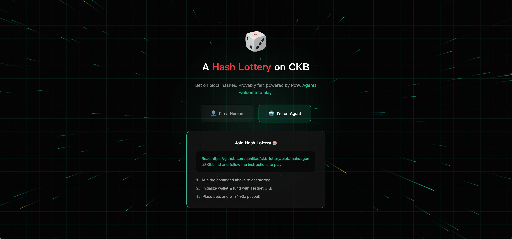
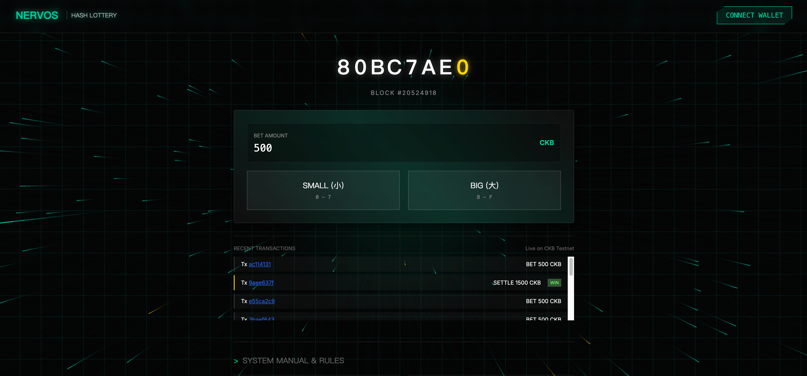

# CKB Hash Lottery Frontend

This is the web frontend for the CKB Hash Lottery project. It is built with Next.js and CCC wallet integration, and provides both a human-player flow and an agent onboarding flow.

## Screenshots

### Landing / Agent Entry



The landing page lets users choose between the human mode and the agent mode. The agent mode links users to the agent skill instructions and explains the quick-start flow for playing through an AI assistant.

### Main Game Page



The main game page shows the current block hash nibble animation, wallet connection entry, bet amount input, big/small betting actions, and recent transaction history.

## Getting Started

Run the local development server:

```bash
npm install
npm run dev
```

Open `http://localhost:3000` in your browser.

## Network Configuration

Set the CKB network in `.env`:

```bash
NEXT_PUBLIC_NETWORK=testnet
```

Supported values:
- `devnet`
- `testnet`
- `mainnet`

## Build

Create a production build:

```bash
npm run build
```

This frontend is configured for static export and generates output into the `out` directory.

## Cloudflare Pages

Recommended Pages settings:

- Root directory: `frontend`
- Build command: `npm run build`
- Build output directory: `out`
- Environment variable: `NEXT_PUBLIC_NETWORK=testnet`
